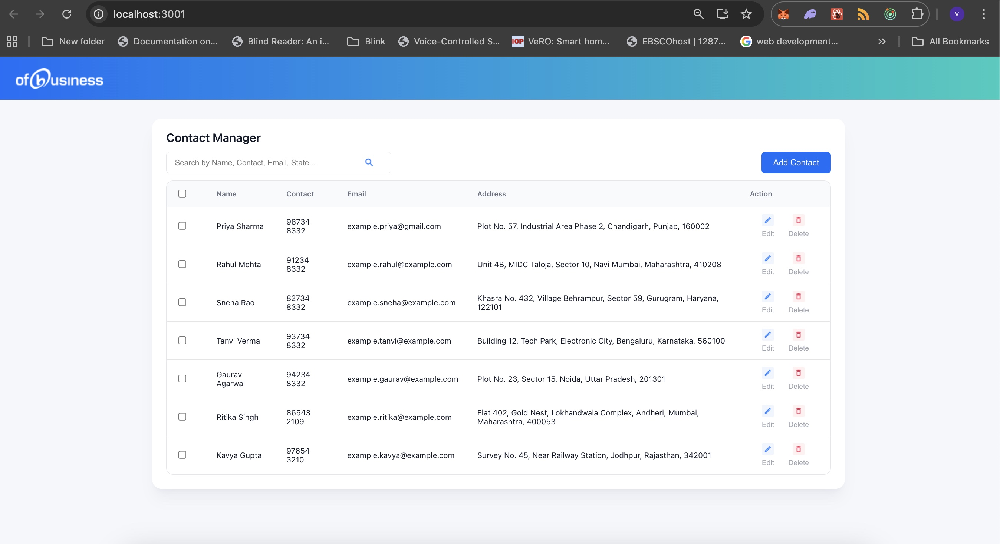
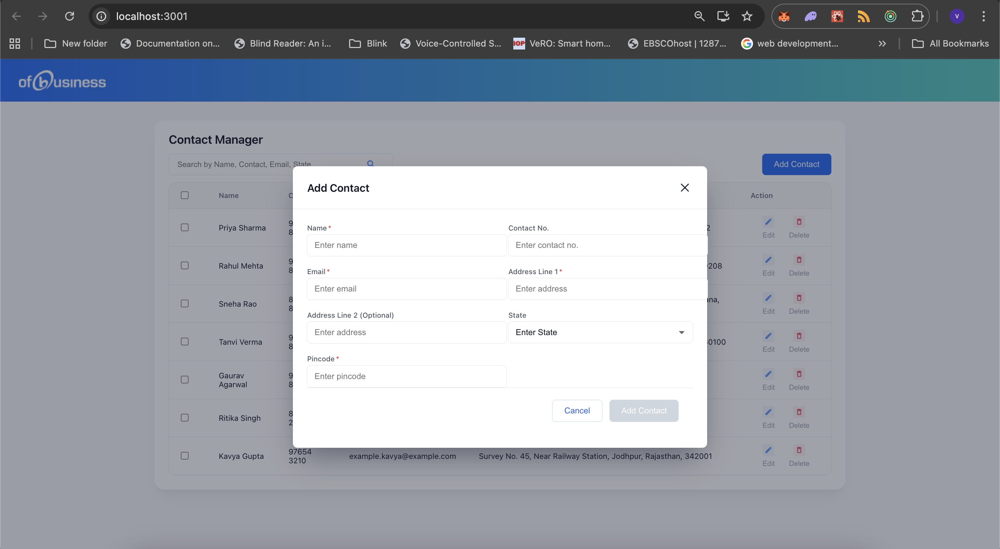
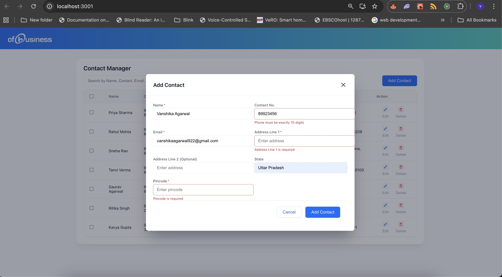
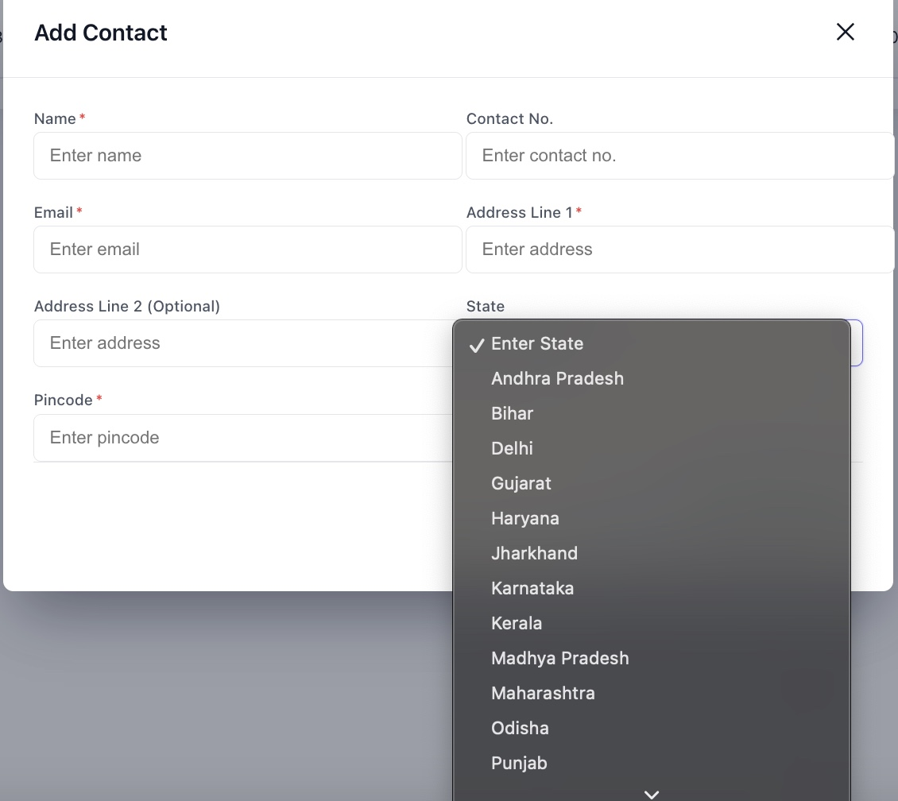
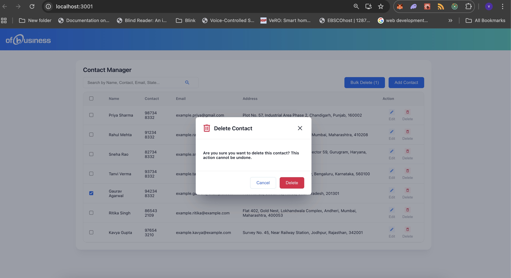
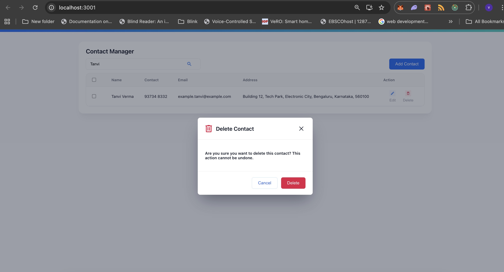
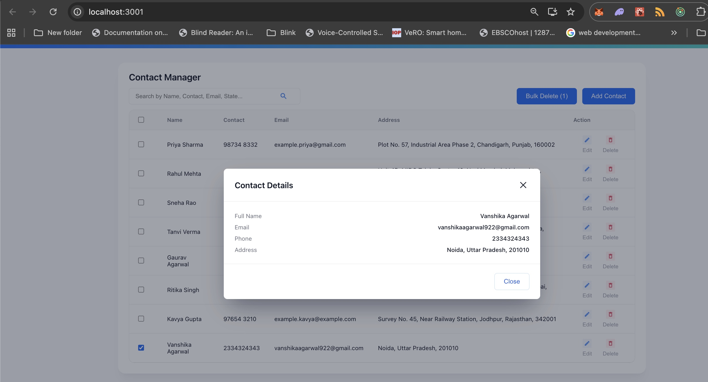
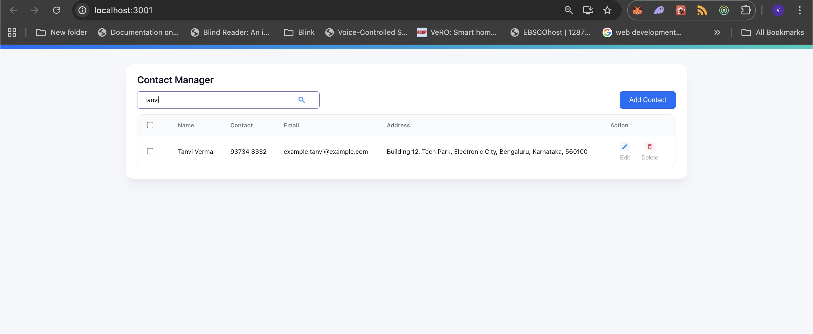

# Contact Manager Application

A modern, feature-rich contact management application built with React, Redux Toolkit, and TypeScript. Manage your contacts efficiently with add, edit, delete, search, and bulk operations capabilities.

## Features

**Core Features:**
-  Add new contacts with full details (Name, Email, Phone, Address, State, Pincode)
-  View contact details in a modal
-  Delete individual contacts with confirmation
-  Bulk delete multiple selected contacts
-  Search contacts by Name, Email, Phone, Address, or State (case Insensitive (Dropdown UI needs some changes))
-  Select/deselect all visible contacts
-  State dropdown with almost all Indian states
-  Form validation with real-time error messages
- **localStorage persistence** - All contacts automatically saved and persist on page refresh (Optional Requirement)

**UI/UX Features:**
- Professional gradient background design
- Intuitive icon-based action buttons (Edit & Delete with icons above text)
- modal dialogs for add/edit/delete operations
- Clean table layout with hover effects
- Blue search icon for quick visual feedback

## Installation & Setup

### Prerequisites
- **Node.js** (v14 or higher)
- **npm** (v6 or higher)

### Step 1: Clone/Download the Project
```bash
cd my-app
```

### Step 2: Install Dependencies

This project uses the following main libraries:

```bash
npm install
```

**Key Libraries Installed:**

| Library | Version | Purpose |
|---------|---------|---------|
| **react** | ^18.2.0 | UI framework |
| **react-dom** | ^18.2.0 | React rendering |
| **@reduxjs/toolkit** | ^1.9.x | State management |
| **react-redux** | ^8.1.x | Redux bindings for React |
| **typescript** | ^4.9.x | Type safety |
| **react-scripts** | ^5.0.x | Build & run scripts |

### Step 3: Install Specific Required Libraries (if not included)

If needed, install Redux dependencies:
```bash
npm install @reduxjs/toolkit react-redux
npm install --save-dev @types/react-redux
```

### Step 4: Run the Application

```bash
npm start
```

This runs the app in development mode. Open [http://localhost:3000](http://localhost:3000) to view it in your browser.

The page will automatically reload when you make changes.

### Step 5: Build for Production

```bash
npm run build
```

Builds the app for production to the `build` folder. The build is minified and optimized for deployment.

## Project Structure

```
my-app/
├── public/
│   ├── assets/
│   │   ├── title.png          # OFBusiness logo
│   │   ├── editicon.png       # Edit button icon
│   │   ├── deleteicon.png     # Delete button icon
│   │   ├── delete.png         # Modal delete icon
│   │   └── icon.png           # Search icon
│   └── index.html
├── src/
│   ├── features/
│   │   └── contacts/
│   │       ├── ContactManagerPage.tsx    # Main page component
│   │       ├── contactsSlice.ts          # Redux state management + localStorage
│   │       ├── types.ts                  # TypeScript interfaces
│   │       └── components/
│   │           ├── AddContactModal.tsx
│   │           ├── ContactDetailsModal.tsx
│   │           ├── ConfirmDeleteModal.tsx
│   └── store.ts                          # Redux store configuration
├── App.tsx
├── App.css
└── package.json
```

## Usage

### Sample Data Included

For reference and UI testing purposes, the application comes pre-loaded with 7 sample contacts:

| Name | Email | Phone | Address | State |
|------|-------|-------|---------|-------|
| Priya Sharma | example.priya@gmail.com | 98734 8332 | Plot No. 57, Industrial Area Phase 2, Chandigarh | Punjab |
| Rahul Mehta | example.rahul@example.com | 91234 8332 | Unit 4B, MIDC Taloja, Sector 10, Navi Mumbai | Maharashtra |
| Sneha Rao | example.sneha@example.com | 82734 8332 | Khasra No. 432, Village Behrampur, Sector 59, Gurugram | Haryana |
| Tanvi Verma | example.tanvi@example.com | 93734 8332 | Building 12, Tech Park, Electronic City, Bengaluru | Karnataka |
| Gaurav Agarwal | example.gaurav@example.com | 94234 8332 | Plot No. 23, Sector 15, Noida | Uttar Pradesh |
| Ritika Singh | example.ritika@example.com | 86543 2109 | Flat 402, Gold Nest, Lokhandwala Complex, Andheri, Mumbai | Maharashtra |
| Kavya Gupta | example.kavya@example.com | 97654 3210 | Survey No. 45, Near Railway Station, Jodhpur | Rajasthan |

These sample contacts help you:
-  See how the UI looks with data
-  Test search functionality
-  Practice delete/bulk delete operations
-  Understand the data structure
-  Verify all features are working

**Note:** When you clear localStorage (via browser DevTools), these sample contacts will be reloaded on page refresh.

### Adding a Contact
1. Click **"Add Contact"** button
2. Fill in the required fields:
   - Name (alphabets only)
   - Email (valid email format)
   - Phone (10 digits)
   - Address Line 1 (required)
   - Address Line 2 (optional)
   - State (select from dropdown)
   - Pincode (6 digits)
3. Click **"Add Contact"** to save (Not the required field as not mentioned in the UI)

### Viewing Contact Details
1. Click on any contact name in the table
2. A modal will display all contact information
3. Click the **X** button to close

### Deleting a Contact
1. Click the **Delete** button with delete icon in the Action column
2. Confirm deletion in the popup
3. Contact is removed and persisted

### Bulk Delete
1. Select multiple contacts using checkboxes
2. The **"Bulk Delete (n)"** button will appear
3. Click it and confirm
4. All selected contacts are deleted

### Searching Contacts
1. Type in the search bar
2. Search works across: Name, Email, Phone, Address, State
3. Results filter in real-time

## Assumptions & Known Limitations

### Assumptions
-  localStorage is available in the browser (modern browsers)
-  Users have JavaScript enabled
-  Maximum reasonable number of contacts (tested up to 1000+)
-  Phone numbers are Indian format (10 digits)
-  Pincode is Indian format (6 digits)
-  One form validation pattern per field (no conditional validation)

### Known Limitations
**Current Version:**
- Edit functionality is not yet implemented (UI in place, backend needed)
- No database integration - data stored only in localStorage (persists until browser storage is cleared)
- No user authentication - all contacts are stored locally per browser
- No export/import feature for contacts
- No contact grouping or categories
- Search is case-insensitive but not fuzzy
- No undo/redo functionality
- Mobile responsiveness could be improved further (optional requirement(didnt got added due to time constraint))
- Maximum localStorage size applies (~5-10MB depending on browser)

### Browser Support
- Chrome/Edge: Full support
- Firefox: Full support
- Safari: Full support
- IE 11: Not supported (uses modern JavaScript features)

## localStorage Persistence

### How It Works
All contacts are automatically saved to the browser's localStorage whenever you:
- Add a new contact
- Update an existing contact
- Delete a contact(s)

### Loading Contacts
When you reload the page:
1. App checks localStorage for saved contacts
2. If found, loads them automatically
3. If empty, loads default sample contacts
4. Console shows: `✓ Loaded contacts from localStorage: X items`

## Screenshots of Project

   ### Main application
   

   ### Add Contact Modal Form
   
   
   


   ### Delete Confirmation
   
   
   

   ### Click on name to view info popup
   

   ### Search functionality
   

   ```


   ```

## Technologies Used

- **React 18** - UI framework
- **Redux Toolkit** - State management
- **TypeScript** - Type safety
- **CSS3** - Styling with custom CSS
- **localStorage API** - Client-side persistence

## API Reference

### Redux Actions (contactsSlice.ts)

```typescript
// Add a new contact
dispatch(addContact({
  fullName: string,
  email: string,
  phone: string,
  address: string
}))

// Update existing contact
dispatch(updateContact({
  id: string,
  fullName: string,
  email: string,
  phone: string,
  address: string
}))

// Delete single contact
dispatch(deleteContact(id: string))

// Delete multiple contacts
dispatch(deleteManyContacts(ids: string[]))
```

## Future Enhancements

-  Edit contact functionality
-  Backend API integration (MongoDB/Firebase)
-  User authentication & personal contacts
-  Export contacts (CSV, PDF)
-  Import contacts from files
-  Contact categorization (Personal, Work, etc.)
-  Duplicate contact detection
-  Cloud sync across devices
-  Mobile app version
-  Theme customization
- Responsiveness

## Troubleshooting

### Issue: App not starting
```bash
# Clear node_modules and reinstall
rm -rf node_modules package-lock.json
npm install
npm start
```

### Issue: Contacts not persisting
1. Check if localStorage is enabled in browser
2. Open DevTools (F12) → Console
3. Run: `console.log(localStorage.getItem('contacts'))`
4. Should show the contacts data

### Issue: Icons not displaying
- Verify files exist in `public/assets/`:
  - `editicon.png`
  - `deleteicon.png`
  - `delete.png`
  - `icon.png`
  - `title.png`
- Try hard refresh: **Ctrl+Shift+R** (Windows/Linux) or **Cmd+Shift+R** (Mac)

## Performance Notes

- All state management is handled in-memory with Redux
- localStorage save operations are optimized
- Search filtering uses useMemo for performance
- No unnecessary re-renders with proper React hooks usage

---


**Last Updated:** January 2026
**Version:** 1.0.0
